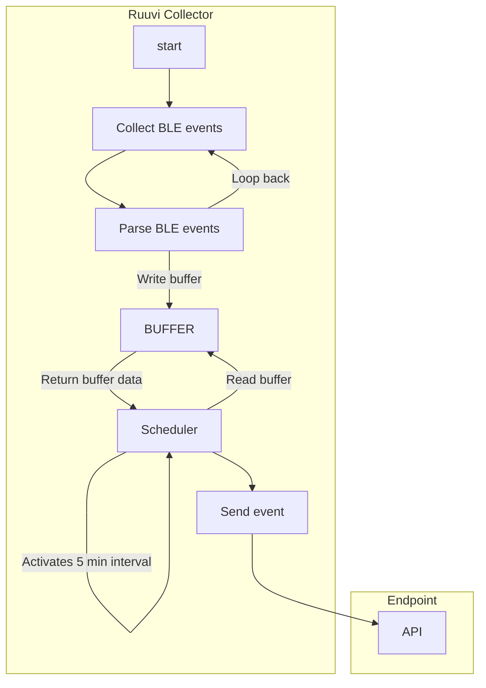

# Ruuvi collector

Collects ruuvi tag data and exports it to a remote server

# Architech

# TODO

- ✅ architech drawing
- 🚫 buffer events
- 🚫 listen ble advertisement messages
- 🚫 parse ble advertisement 
- 🚫 send data to cloud endpoint
- 🚫 should use zod and tRPC?
- 🚫 typescript type tests?
